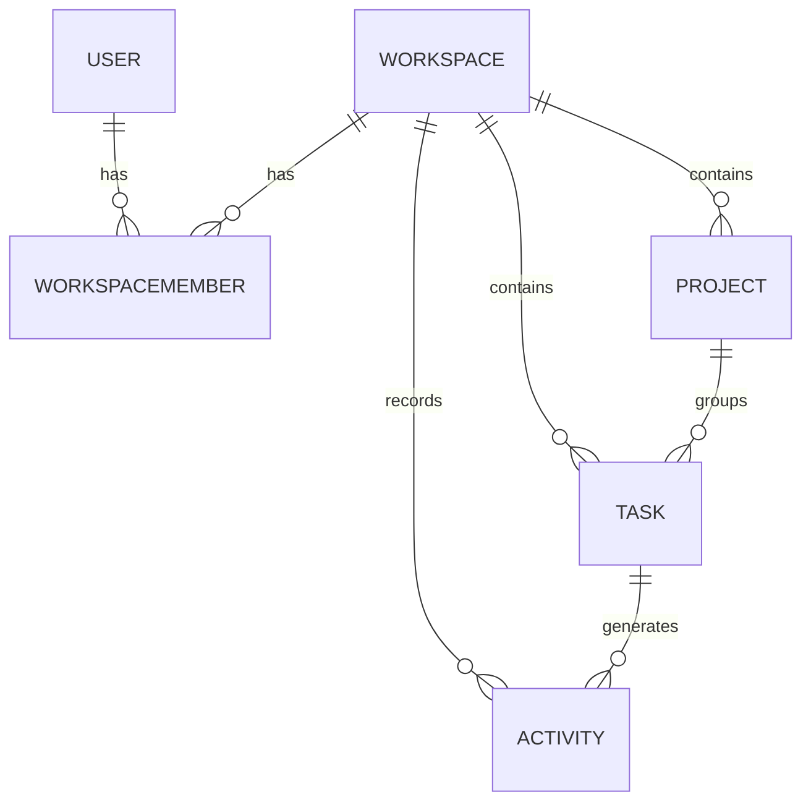

# Data Model: Interactive Views & Workspace Management

**Spec**: [spec.md](./spec.md)
**Plan**: [plan.md](./plan.md)
**Date**: 2026-02-08

## 1. Entity Relationship Diagram (Conceptual)



## 2. Detailed Data Models

### 2.1 User (Existing Model - assumed to have `id`, `email`, `password_hash`, etc.)

*No changes to the core User model, but its `id` will be used for relationships.*

```python
# Reference (conceptual, actual implementation in backend/src/models/user.py)
class User(SQLModel, table=True):
    id: Optional[UUID] = Field(default_factory=uuid4, primary_key=True)
    email: str = Field(unique=True, index=True)
    password_hash: str
    is_active: bool = Field(default=True)
    is_superuser: bool = Field(default=False)
    # ... other user fields
```

### 2.2 Workspace

Represents a container for tasks and projects, allowing users to organize their work into separate contexts.

```python
# backend/src/models/workspace.py
from datetime import datetime
from typing import List, Optional
from uuid import UUID, uuid4

from sqlmodel import Field, Relationship, SQLModel

class Workspace(SQLModel, table=True):
    id: Optional[UUID] = Field(default_factory=uuid4, primary_key=True)
    name: str = Field(index=True)
    description: Optional[str] = None
    created_by: UUID = Field(foreign_key="user.id", index=True) # User who created the workspace
    created_at: datetime = Field(default_factory=datetime.utcnow, nullable=False)
    updated_at: datetime = Field(default_factory=datetime.utcnow, nullable=False, sa_column_kwargs={"onupdate": datetime.utcnow})

    # Relationships
    members: List["WorkspaceMember"] = Relationship(back_populates="workspace")
    projects: List["Project"] = Relationship(back_populates="workspace")
    tasks: List["Task"] = Relationship(back_populates="workspace")
    activities: List["Activity"] = Relationship(back_populates="workspace")
```

### 2.3 WorkspaceMember

An association table to manage many-to-many relationships between `User` and `Workspace`, including user roles within a workspace.

```python
# backend/src/models/workspace_member.py
from datetime import datetime
from typing import Optional
from uuid import UUID, uuid4
from enum import Enum

from sqlmodel import Field, Relationship, SQLModel

class WorkspaceRole(str, Enum):
    OWNER = "owner"
    ADMIN = "admin"
    MEMBER = "member"
    VIEWER = "viewer"

class WorkspaceMember(SQLModel, table=True):
    id: Optional[UUID] = Field(default_factory=uuid4, primary_key=True)
    workspace_id: UUID = Field(foreign_key="workspace.id", primary_key=True)
    user_id: UUID = Field(foreign_key="user.id", primary_key=True)
    role: WorkspaceRole = Field(default=WorkspaceRole.MEMBER) # Role of the user in this workspace
    joined_at: datetime = Field(default_factory=datetime.utcnow, nullable=False)

    # Relationships
    workspace: "Workspace" = Relationship(back_populates="members")
    user: "User" = Relationship(back_populates="workspace_members") # Assuming User model will have 'workspace_members' back_populates
```

### 2.4 Project

Represents a collection of related tasks within a specific workspace.

```python
# backend/src/models/project.py
from datetime import datetime
from typing import List, Optional
from uuid import UUID, uuid4

from sqlmodel import Field, Relationship, SQLModel

class Project(SQLModel, table=True):
    id: Optional[UUID] = Field(default_factory=uuid4, primary_key=True)
    name: str = Field(index=True)
    description: Optional[str] = None
    workspace_id: UUID = Field(foreign_key="workspace.id", index=True, nullable=False)
    created_by: UUID = Field(foreign_key="user.id", index=True)
    created_at: datetime = Field(default_factory=datetime.utcnow, nullable=False)
    updated_at: datetime = Field(default_factory=datetime.utcnow, nullable=False, sa_column_kwargs={"onupdate": datetime.utcnow})

    # Relationships
    workspace: "Workspace" = Relationship(back_populates="projects")
    tasks: List["Task"] = Relationship(back_populates="project")
```

### 2.5 Task (Extension of existing model)

The core work item, now enhanced with `workspace_id`, `project_id`, and a more explicit `status` enum.

```python
# backend/src/models/task.py (existing file, to be modified)
from datetime import datetime
from typing import List, Optional
from uuid import UUID, uuid4
from enum import Enum

from sqlmodel import Field, Relationship, SQLModel

class TaskStatus(str, Enum):
    TODO = "todo"
    IN_PROGRESS = "in_progress"
    REVIEW = "review"
    DONE = "done"

class TaskPriority(str, Enum):
    LOW = "low"
    MEDIUM = "medium"
    HIGH = "high"
    URGENT = "urgent"

class Task(SQLModel, table=True):
    id: Optional[UUID] = Field(default_factory=uuid4, primary_key=True)
    title: str = Field(index=True)
    description: Optional[str] = None
    status: TaskStatus = Field(default=TaskStatus.TODO, nullable=False)
    priority: TaskPriority = Field(default=TaskPriority.MEDIUM, nullable=False)
    
    # New fields for workspace and project association
    workspace_id: UUID = Field(foreign_key="workspace.id", index=True, nullable=False)
    project_id: Optional[UUID] = Field(default=None, foreign_key="project.id", index=True)
    
    created_by: UUID = Field(foreign_key="user.id", index=True) # User who created the task
    assigned_to: Optional[UUID] = Field(default=None, foreign_key="user.id", index=True) # User assigned to the task
    
    created_at: datetime = Field(default_factory=datetime.utcnow, nullable=False)
    updated_at: datetime = Field(default_factory=datetime.utcnow, nullable=False, sa_column_kwargs={"onupdate": datetime.utcnow})
    completed_at: Optional[datetime] = None

    # Relationships
    workspace: "Workspace" = Relationship(back_populates="tasks")
    project: Optional["Project"] = Relationship(back_populates="tasks")
    activities: List["Activity"] = Relationship(back_populates="task") # Activities related to this task
    creator: "User" = Relationship(back_populates="created_tasks", sa_relationship_kwargs={"foreign_keys": "[Task.created_by]"})
    assignee: Optional["User"] = Relationship(back_populates="assigned_tasks", sa_relationship_kwargs={"foreign_keys": "[Task.assigned_to]"})

```

### 2.6 Activity

Logs significant events within a workspace, such as task creation, status changes, etc.

```python
# backend/src/models/activity.py
from datetime import datetime
from typing import Optional
from uuid import UUID, uuid4
from enum import Enum

from sqlmodel import Field, Relationship, SQLModel

class ActivityType(str, Enum):
    TASK_CREATED = "task_created"
    TASK_STATUS_CHANGED = "task_status_changed"
    TASK_PRIORITY_CHANGED = "task_priority_changed"
    TASK_ASSIGNED = "task_assigned"
    TASK_DELETED = "task_deleted"
    WORKSPACE_CREATED = "workspace_created"
    WORKSPACE_MEMBER_ADDED = "workspace_member_added"
    # ... other activity types

class Activity(SQLModel, table=True):
    id: Optional[UUID] = Field(default_factory=uuid4, primary_key=True)
    workspace_id: UUID = Field(foreign_key="workspace.id", index=True, nullable=False)
    user_id: UUID = Field(foreign_key="user.id", index=True, nullable=False) # User who performed the action
    task_id: Optional[UUID] = Field(default=None, foreign_key="task.id", index=True) # Optional: if activity is task-related
    activity_type: ActivityType = Field(nullable=False)
    description: str = Field(nullable=False) # Human-readable description of the activity
    created_at: datetime = Field(default_factory=datetime.utcnow, nullable=False)

    # Relationships
    workspace: "Workspace" = Relationship(back_populates="activities")
    user: "User" = Relationship(back_populates="activities") # Assuming User model will have 'activities' back_populates
    task: Optional["Task"] = Relationship(back_populates="activities")
```

### 2.7 Subscription Plan (Conceptual)

This model is primarily for frontend representation and API response, not necessarily a persistent backend model that tracks individual plans in a database for *this* project, as billing is presentational only. If a backend model were needed, it might look like this:

```python
# Conceptual - May not be a direct SQLModel table in this phase
from typing import List
from pydantic import BaseModel

class Feature(BaseModel):
    name: str
    description: str

class SubscriptionPlan(BaseModel):
    name: str # e.g., "Free", "Pro", "Business"
    price: float # monthly price
    currency: str
    features: List[Feature]
    is_current_plan: bool = False
```

## 3. SQLModel Relationship Updates (Existing Models)

*To properly set up `Relationship` back-populates, existing models (like `User`) might need updates.*

### 3.1 User Model (Modification required in `backend/src/models/user.py`)

Add the following relationships to the `User` SQLModel.

```python
# backend/src/models/user.py (modifications)
from typing import List, Optional
from sqlmodel import Relationship

class User(SQLModel, table=True):
    # ... existing fields

    # New Relationships
    workspace_members: List["WorkspaceMember"] = Relationship(back_populates="user")
    created_tasks: List["Task"] = Relationship(back_populates="creator", sa_relationship_kwargs={"foreign_keys": "[Task.created_by]"})
    assigned_tasks: List["Task"] = Relationship(back_populates="assignee", sa_relationship_kwargs={"foreign_keys": "[Task.assigned_to]"})
    activities: List["Activity"] = Relationship(back_populates="user")
```

## 4. Enum Definitions (Centralized or within models)

The enums `TaskStatus`, `TaskPriority`, `WorkspaceRole`, `ActivityType` will be defined directly within their respective SQLModel classes as shown above for clarity and colocation.
